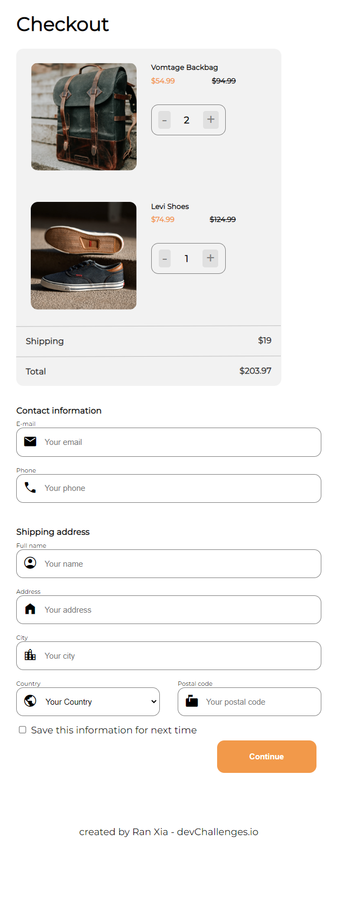
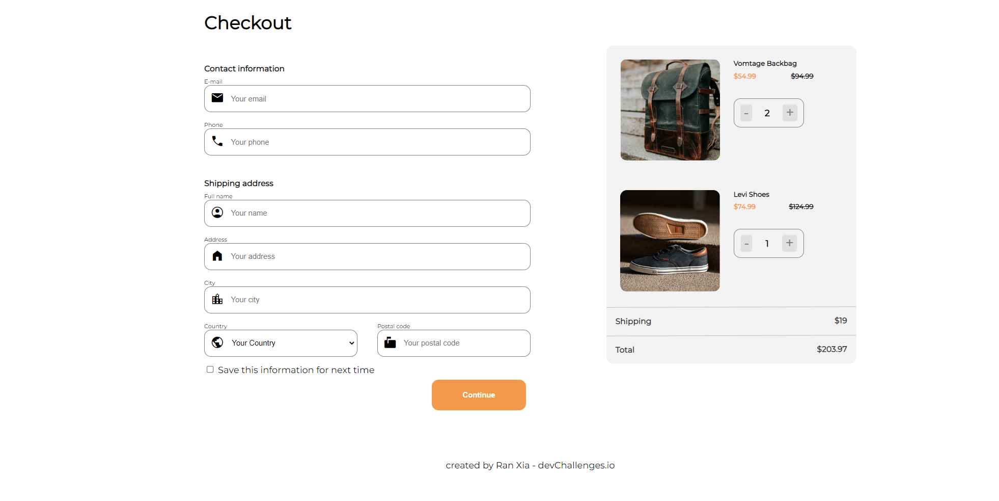

<!-- Please update value in the {}  -->

<h1 align="center">Checkout Page</h1>

<div align="center">
   Solution for a challenge from  <a href="http://devchallenges.io" target="_blank">Devchallenges.io</a>.
</div>

<div align="center">
  <h3>
    <a href="https://devchallenge-checkout-page.web.app">
      Demo
    </a>
    <span> | </span>
    <a href="https://github.com/RanningMan/devchallenges/tree/main/checkout-page">
      Solution
    </a>
    <span> | </span>
    <a href="https://devchallenges.io/challenges/0J1NxxGhOUYVqihwegfO">
      Challenge
    </a>
  </h3>
</div>

<!-- TABLE OF CONTENTS -->

## Table of Contents

- [Overview](#overview)
  - [Built With](#built-with)
- [Features](#features)
- [Contact](#contact)
- [Acknowledgements](#acknowledgements)

<!-- OVERVIEW -->

## Overview




The demo is able to send all the info including item info and user info to backend. There are inline alerts when the email format is not valid. It's actually a surprise to me how difficult it is to build and style a form from scratch, if not usingt any design system or library.

learning:
#### 1. how to style a form.
Styling a form is not that easy without using a framework. I learned below 3 things when I'm doing this practice.

1.1 how to put an icon inside an input element
    
    ```
      <div>
          <i>location_city</i>
          <input type='text' />
      </div>

      i {
          border: 1px solid #828282;
          border-right: none;
          border-top-left-radius: 12px;
          border-bottom-left-radius: 12px;
      }

      input {
          border: 1px solid #828282;
          border-left: none;
          border-top-right-radius: 12px;
          border-bottom-right-radius: 12px;
      }
    ```
1.2 how to style select and option elements

This turns out to be a quite difficult job. Basically if you want to build a dropdown widget, you don't want to use select and option; instead you want to create a dropdown using ul and li from scratch. Because select is really really hard to style.

Checkout this blog from MDN to learn more on how to build dropdown widget
https://developer.mozilla.org/en-US/docs/Learn/Forms/How_to_build_custom_form_controls#defining_the_html_structure_and_some_semantics

1.3 how to do input validation
  - use default validation (required), it only validates if the input is empty or not.
  - attach the logic to onBlur event, then styling when the validation fails

#### 2. React context API best practice
- Use React Context with a custom Provider and a custom hook. Wrap logic and state of context component in a provider component creates a much clear and safer way to use context.
- memoize both the individual variables and functions inside the context value and the overall contextValue
- Separate state and state setters (if necessary)
- If used with useReducer, the code can be very nice: https://kentcdodds.com/blog/how-to-use-react-context-effectively


### Built With

<!-- This section should list any major frameworks that you built your project using. Here are a few examples.-->

- [React](https://reactjs.org/)


## Features

<!-- List the features of your application or follow the template. Don't share the figma file here :) -->

This application was created as a submission to a [DevChallenges](https://devchallenges.io/challenges) challenge. The [challenge](https://devchallenges.io/challenges/0J1NxxGhOUYVqihwegfO) was to build an application to complete the given user stories.

- [x] User story: I can see a page following the given design
- [x] User story: I can input email, phone, full name, address, city, country, and postal code
- [x] User story: I can input the number of items
- [x] User story: I can select at least 3 countries from the dropdown
- [x] User story: When I click submit button or press enter, I can see a warning if validation fails
- [x] User story: When I click submit button or press enter, I can see a successful alert if validation succeeds


## Acknowledgements

<!-- This section should list any articles or add-ons/plugins that helps you to complete the project. This is optional but it will help you in the future. For exmpale -->

- [Steps to replicate a design with only HTML and CSS](https://devchallenges-blogs.web.app/how-to-replicate-design/)
- [Node.js](https://nodejs.org/)
- [Marked - a markdown parser](https://github.com/chjj/marked)

## Contact

- Website [rxia.me](https://rxia.me)
- GitHub [@RanningMan](https://github.com/ranningman)
