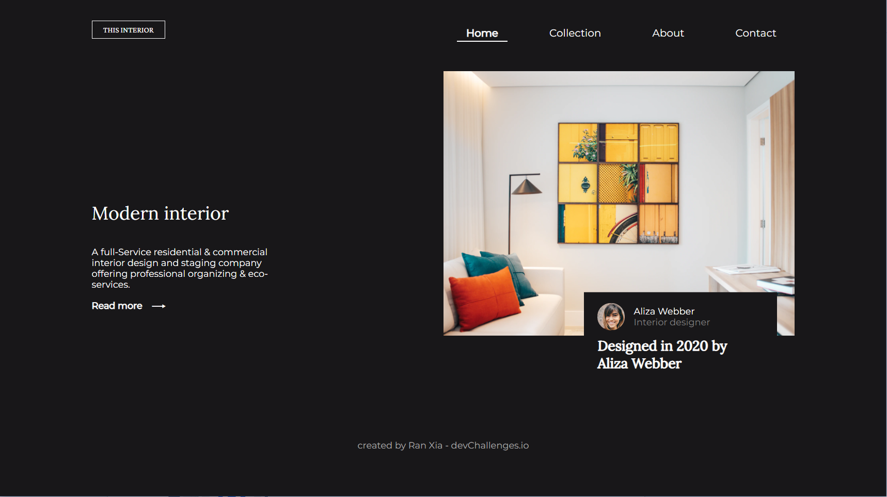
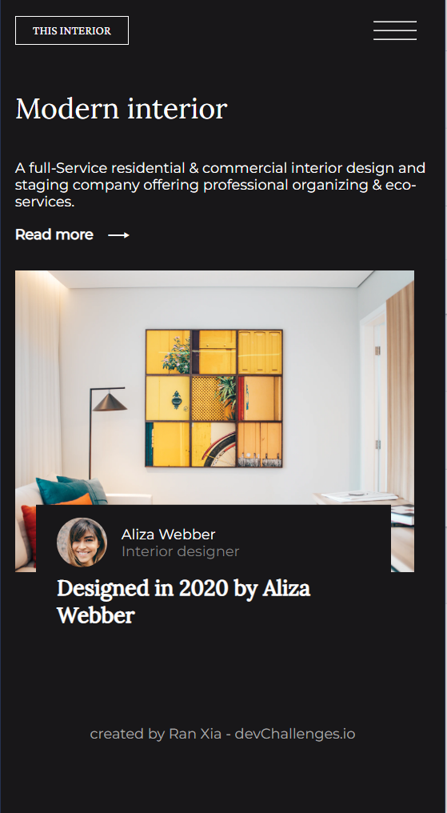
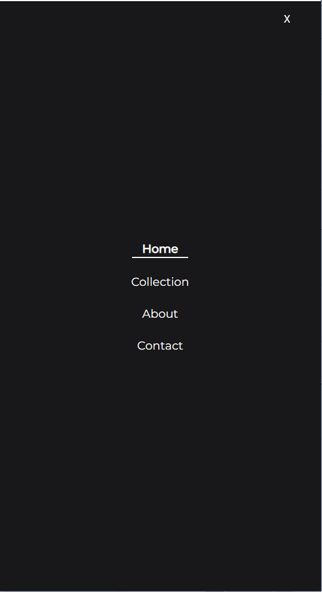

<!-- Please update value in the {}  -->

<h1 align="center">Interior Consultant</h1>

<div align="center">
   Solution for a challenge from  <a href="http://devchallenges.io" target="_blank">Devchallenges.io</a>.
</div>

<div align="center">
  <h3>
    <a href="https://devchallenge-interior-design.web.app/">
      Demo
    </a>
    <span> | </span>
    <a href="https://github.com/RanningMan/devchallenges/tree/main/interior-consultant">
      Solution
    </a>
    <span> | </span>
    <a href="https://devchallenges.io/challenges/Jymh2b2FyebRTUljkNcb">
      Challenge
    </a>
  </h3>
</div>

<!-- TABLE OF CONTENTS -->

## Table of Contents

- [Overview](#overview)
  - [Built With](#built-with)
- [Features](#features)
- [Contact](#contact)
- [Acknowledgements](#acknowledgements)

<!-- OVERVIEW -->

## Overview





Please visit https://devchallenge-interior-design.web.app to checkout my demo. I built this with React. A few things I reviewed during the practice:

1. Add footer: set ```display: flex; flex-direction: column; justify-content: space-between;``` to highest level component. 
2. Navigation component
  There are two ways to set navigation component responsive and display different component based on screen size: use matchmedia and use window.innerWidth. I used innerWidth in this practice.
3. Move element to top 50%: set ```translate: 0 -50%;``` to the element.

### Built With

<!-- This section should list any major frameworks that you built your project using. Here are a few examples.-->

- [React](https://reactjs.org/)

## Features

<!-- List the features of your application or follow the template. Don't share the figma file here :) -->

This application/site was created as a submission to a [DevChallenges](https://devchallenges.io/challenges) challenge. The [challenge](https://devchallenges.io/challenges/Jymh2b2FyebRTUljkNcb) was to build an application to complete the given user stories.

## Acknowledgements

<!-- This section should list any articles or add-ons/plugins that helps you to complete the project. This is optional but it will help you in the future. For exmpale -->

- [Steps to replicate a design with only HTML and CSS](https://devchallenges-blogs.web.app/how-to-replicate-design/)
- [Node.js](https://nodejs.org/)
- [Marked - a markdown parser](https://github.com/chjj/marked)

## Contact

- Website [your-website.com](https://rxia.me)
- GitHub [@your-username](https://github.com/ranningman)
