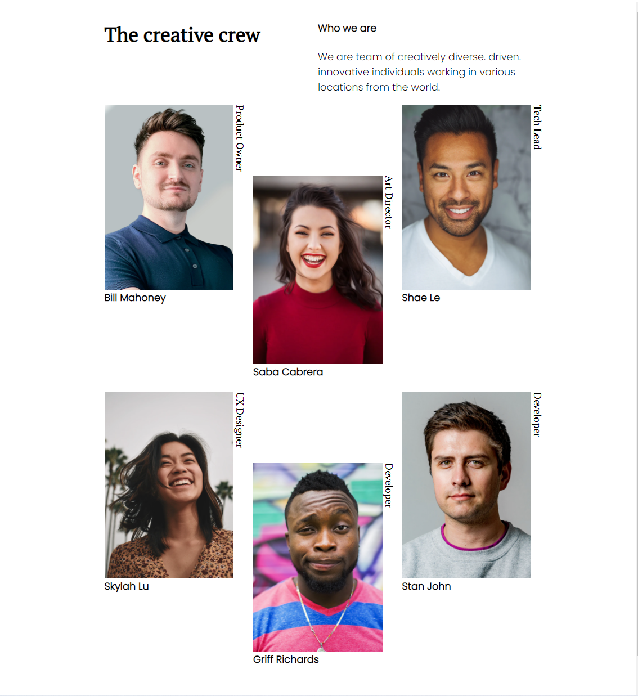
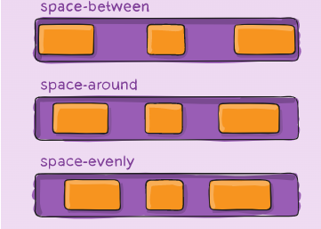

<!-- Please update value in the {}  -->

<h1 align="center">My Team Page</h1>

<div align="center">
   Solution for a challenge from  <a href="http://devchallenges.io" target="_blank">Devchallenges.io</a>.
</div>

<div align="center">
  <h3>
    <a href="https://devchallenge-my-team-page.web.app">
      Demo
    </a>
    <span> | </span>
    <a href="https://github.com/RanningMan/devchallenges/tree/main/my-team-page">
      Solution
    </a>
    <span> | </span>
    <a href="https://devchallenges.io/challenges/hhmesazsqgKXrTkYkt0U">
      Challenge
    </a>
  </h3>
</div>

<!-- TABLE OF CONTENTS -->

## Table of Contents

- [Overview](#overview)
  - [Built With](#built-with)
- [Features](#features)
- [Contact](#contact)
- [Acknowledgements](#acknowledgements)

<!-- OVERVIEW -->

## Overview



Please visit [https://devchallenge-my-team-page.web.app](https://devchallenge-my-team-page.web.app) to check out my demo. This time I'm using a pure html + CSS to build this page. Highlight of this project is that I learned a new css property: writing-mode.

Learning:
  
  >```writing-mode: vertical-lr;```
  
  justify-content: 
  
  >

### Built With

html5 + css3

## Features

<!-- List the features of your application or follow the template. Don't share the figma file here :) -->

This application/site was created as a submission to a [DevChallenges](https://devchallenges.io/challenges) challenge. The [challenge](https://devchallenges.io/challenges/hhmesazsqgKXrTkYkt0U) was to build an application to complete the given user stories.


## Acknowledgements

<!-- This section should list any articles or add-ons/plugins that helps you to complete the project. This is optional but it will help you in the future. For exmpale -->

- [Steps to replicate a design with only HTML and CSS](https://devchallenges-blogs.web.app/how-to-replicate-design/)
- [Node.js](https://nodejs.org/)
- [Marked - a markdown parser](https://github.com/chjj/marked)

## Contact

- Website [rxia.me](https://rxia.me)
- GitHub [@RanningMan](https://github.com/ranningman)
