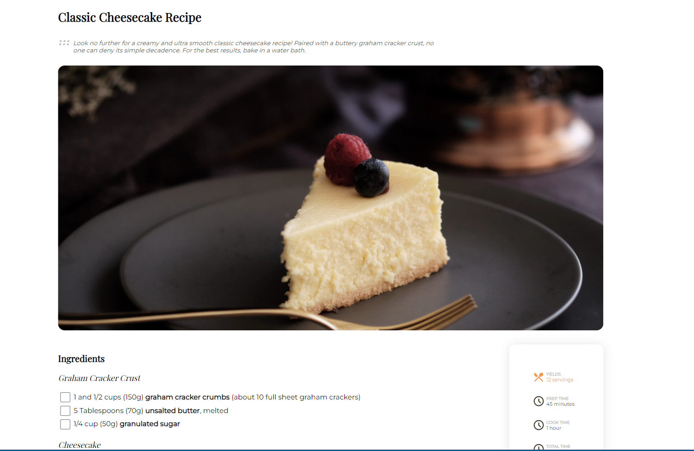

<!-- Please update value in the {}  -->

<h1 align="center">Recipe Page</h1>

<div align="center">
   Solution for a challenge from  <a href="http://devchallenges.io" target="_blank">Devchallenges.io</a>.
</div>

<div align="center">
  <h3>
    <a href="https://devchallenge-recipe-page.web.app/">
      Demo
    </a>
    <span> | </span>
    <a href="https://github.com/RanningMan/devchallenges/tree/main/recipe-page">
      Solution
    </a>
    <span> | </span>
    <a href="https://devchallenges.io/challenges/OEKdUZ6xs0h99C38XVht">
      Challenge
    </a>
  </h3>
</div>

<!-- TABLE OF CONTENTS -->

## Table of Contents

- [Overview](#overview)
  - [Built With](#built-with)
- [Features](#features)
- [How to use](#how-to-use)
- [Contact](#contact)
- [Acknowledgements](#acknowledgements)

<!-- OVERVIEW -->

## Overview



Learning:
1. Semantic html: a common semantic html structure looks like below:
```
<header></header>
<main>
  <section>
    <article>
      <figure>
        
        <figcaption></figcaption>
      </figure>
    </article>
  </section>
</main>
<footer></footer>
```
2. How to style checkbox: 

    reference: https://moderncss.dev/pure-css-custom-checkbox-style/
3. CSS counter:
```
body {
  counter-reset: section; /* Set a counter named 'section', and its initial value is 0. */
}

h3::before {
  counter-increment: section; /* Increment the value of section counter by 1 */
  content: counter(section); /* The value of section counter */
}

```

### Built With

<!-- This section should list any major frameworks that you built your project using. Here are a few examples.-->

- Pure HTML + CSS

## Features

<!-- List the features of your application or follow the template. Don't share the figma file here :) -->

This application/site was created as a submission to a [DevChallenges](https://devchallenges.io/challenges) challenge. The [challenge](https://devchallenges.io/challenges/TtUjDt19eIHxNQ4n5jps) was to build an application to complete the following user stories:

- [x] User story: I can see a recipe with ingredients and instructions
- [x] User story: I can select a checkbox if I have the ingredients
- [x] User story: I can see the number of servings, baking times

## Acknowledgements

<!-- This section should list any articles or add-ons/plugins that helps you to complete the project. This is optional but it will help you in the future. For exmpale -->

- [Steps to replicate a design with only HTML and CSS](https://devchallenges-blogs.web.app/how-to-replicate-design/)
- [Node.js](https://nodejs.org/)
- [Marked - a markdown parser](https://github.com/chjj/marked)

## Contact

- Website [https://rxia.me](https://rxia.me)
- GitHub [@RanningMan](https://github.com/ranningman)
