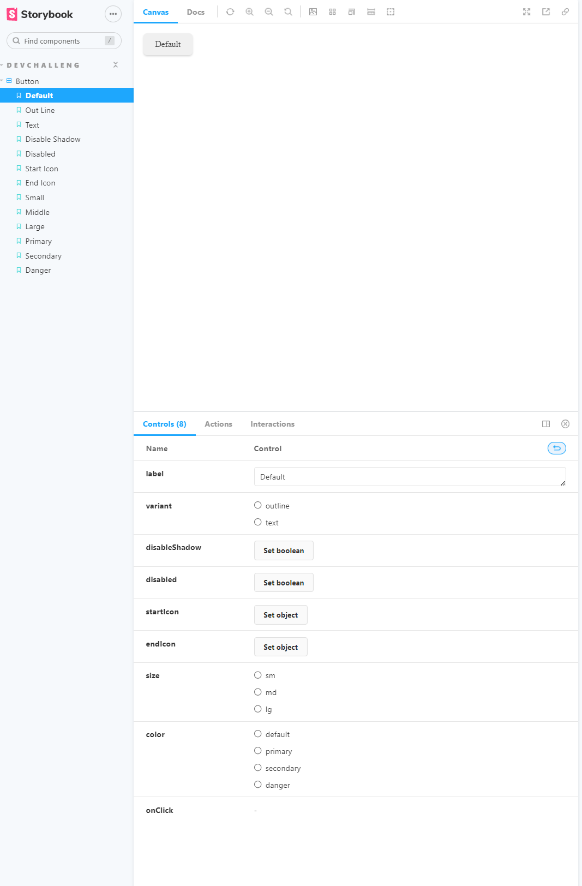

<!-- Please update value in the {}  -->

<h1 align="center">Button Component</h1>

<div align="center">
   Solution for a challenge from  <a href="http://devchallenges.io" target="_blank">Devchallenges.io</a>.
</div>


<div align="center">
  <h3>
    <a href="https://{your-demo-link.your-domain}">
      Demo
    </a>
    <span> | </span>
    <a href="https://{your-url-to-the-solution}">
      Solution
    </a>
    <span> | </span>
    <a href="https://devchallenges.io/challenges/ohgVTyJCbm5OZyTB2gNY">
      Challenge
    </a>
  </h3>
</div>


<!-- TABLE OF CONTENTS -->

## Table of Contents

- [Overview](#overview)
  - [Built With](#built-with)
- [Features](#features)
- [How to use](#how-to-use)
- [Contact](#contact)
- [Acknowledgements](#acknowledgements)

<!-- OVERVIEW -->

## Overview



In this practice, I used storybook to organize the component. It is a fun a useful tool to me. Plus it is easy to start as the learning curve is flat.

Learning
1. The Button component is built with storybook and organized as different stories.
2. Using propTypes to manage the props when typescript is not used.
3. Select elements which has multiple ID and class selectors:
    ```
    #id.foo.bar {
        /* Styles for element(s) with foo AND bar classes */
    }
    ```

### Built With

<!-- This section should list any major frameworks that you built your project using. Here are a few examples.-->

- [React](https://reactjs.org/)
- [Storybook](https://storybook.js.org/)

## Features

<!-- List the features of your application or follow the template. Don't share the figma file here :) -->

This application/site was created as a submission to a [DevChallenges](https://devchallenges.io/challenges) challenge. The [challenge](https://devchallenges.io/challenges/ohgVTyJCbm5OZyTB2gNY) was to build an application to complete the given user stories.
 - [x] User story: I can see different button types: default, outline and text
 - [x] User story: I can choose to disable box-shadow
 - [x] User story: I can choose to disable the button
 - [x] User story: I can choose to have an icon on the left or right (Use Google Icon and at least 5 variants)
 - [x] User story: I can have different button sizes
 - [x] User story: I can have different colors
 - [x] User story: When I hover or focus, I can see visual indicators
 - [x] User story: I can still access all button attributes
 - [x] User story (optional): Show button in a similar way like the design or use Storybook. Otherwise, showing the button in multiple states is enough


## Acknowledgements

<!-- This section should list any articles or add-ons/plugins that helps you to complete the project. This is optional but it will help you in the future. For exmpale -->

- [Steps to replicate a design with only HTML and CSS](https://devchallenges-blogs.web.app/how-to-replicate-design/)
- [Node.js](https://nodejs.org/)
- [Marked - a markdown parser](https://github.com/chjj/marked)

## Contact

- Website [rxia.me](https://rxia.me)
- GitHub [@RanningMan](https://github.com/ranningman})